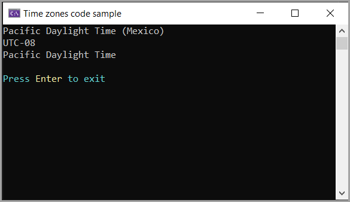

# Get timezones

Code to get timezones for the computer running the code with an Internet connection.

For some, this can be seen as an exercise/learning expereince dependent on expertise level. Others may scrutinize aspects of the code, there is usually at least one that will overthink or find improvements.

